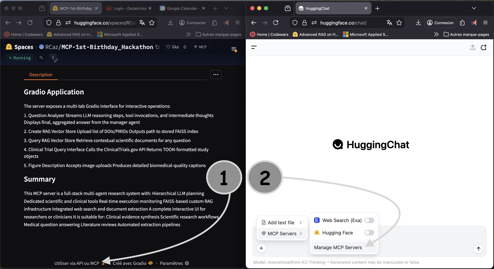
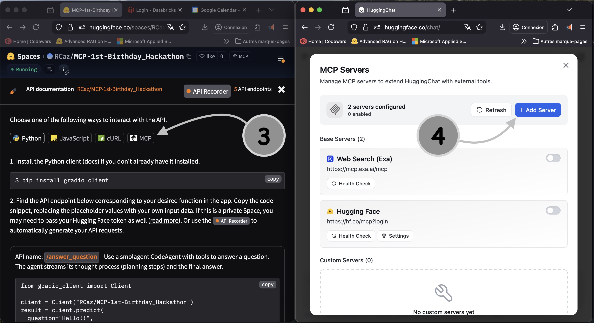
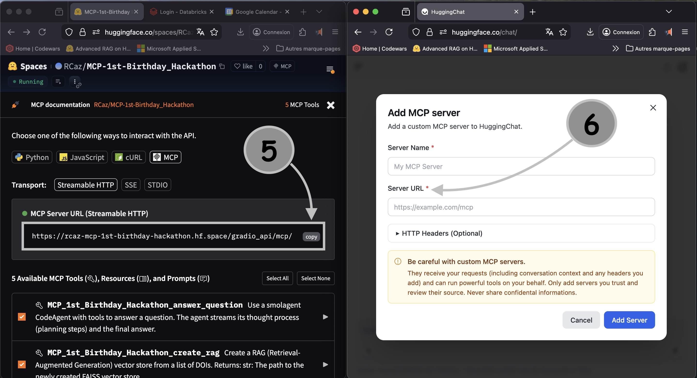

link to social media : https://www.linkedin.com/feed/update/urn:li:activity:7400904066005966848/

link to vidéo : 

# Project description

This MCP server provides a multi-agent, tool-augmented reasoning system designed for clinical research, biomedical analysis, and scientific information retrieval. It integrates structured clinical trial querying, PubMed literature search, PDF parsing, RAG-based document retrieval, and web research into a single orchestrated environment.

At its core is a Manager Agent (smolagents) that interprets user questions, plans multi-step reasoning, and coordinates two specialized agents:

1. Clinical Agent

Queries ClinicalTrials.gov with structured filters

Retrieves PubMed articles

Extracts text from scientific PDFs

Produces structured tables, trial summaries, and evidence-based reports

2. Online Information Agent

Performs Wikipedia and DuckDuckGo searches

Visits and extracts content from arbitrary webpages

Supports general research, context building, and cross-verification

## Summary

This MCP server is a full-stack multi-agent research system with:

Hierarchical LLM planning

Dedicated scientific and clinical tools

Real-time execution monitoring

FAISS-based custom RAG infrastructure

Integrated web search and document extraction

A complete interactive UI for researchers or clinicians

It is suitable for:

Clinical evidence synthesis

Scientific research workflows

Medical question answering

Literature reviews

Automated extraction pipelines

# Use Gradio Interface
Use the specialized code agent from gradio interface [track agent reasonning]
* Must Add NEBIUS_API_KEY secrets to the huggingface space in order to use the Agent
* Add LANGFUSE secrets to track

# Set-up MCP tools for a client (huggingchat)

## 1. Server side : Connect to the space and click "Utiliser via API"

## 2. Client side : Select "Manage MCP server" on huggingchat

# --------------------------------------------------------

## 3. Server side : Choose communication type (MCP streamable HTTP)

## 4. Client side : Click on "Add Server"

# ---------------------------------------------------------

## 5. Server side : Copy the link for the client side (MCP streamable HTTP)

## 6. Client side : Paste the link Click in "Server URL"

# ----------------------------------------------------------

# Chat with data
 
## 7. Query LLM Without/With MCP tool changes the actions/output
## 8. The MCP tools can be called multiple times (x6) in a single request

